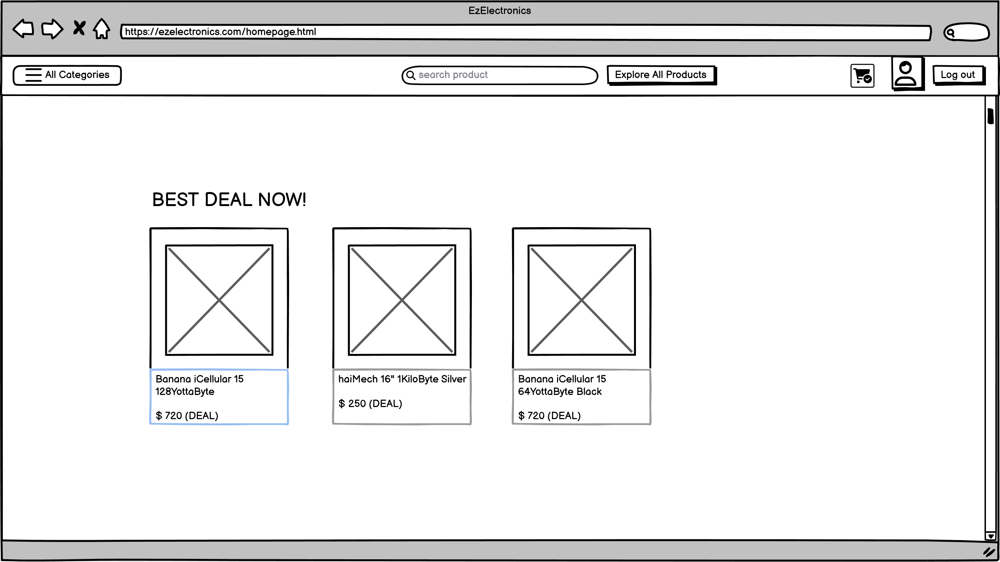

# Graphical User Interface Prototype - CURRENT

Authors: Sebastiano Guzzone, Simone Nicol, Matin Bayramli, Flavia Calabrese

Date: 26-04-2024

Version: V1

| Version number |            Change            |
| :------------: | :--------------------------: |
|      V1.1      | Add GUI components and views |

## Customer GUI

### Login

.png>) 

### Products

 
   

### Carts

 .png>)   

## Manager GUI

### Login

### Products

.png>)

