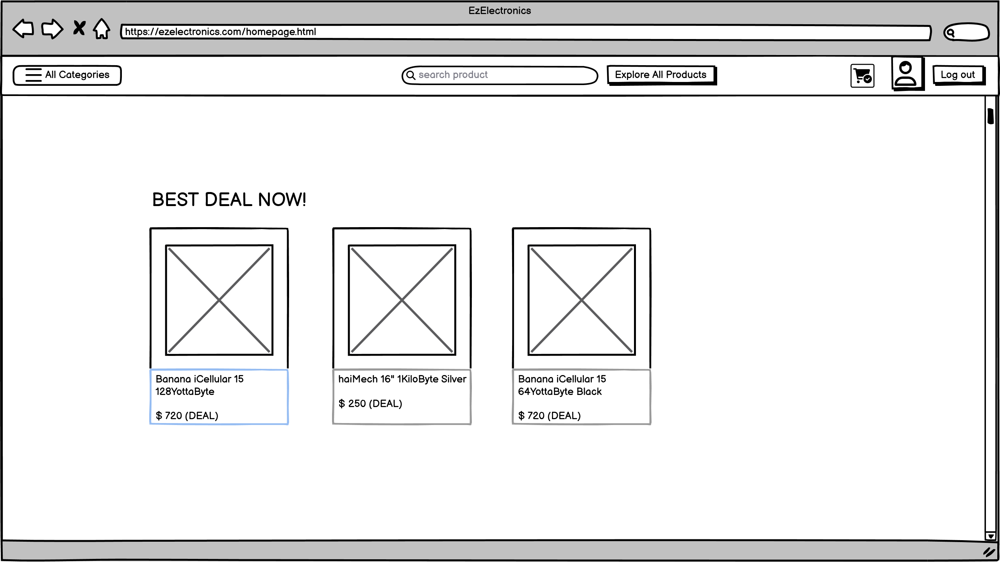

# Graphical User Interface Prototype - FUTURE

Authors: Sebastiano Guzzone, Simone Nicol, Matin Bayramli, Flavia Calabrese

Date: 26-04-2024

Version: V1

| Version number |            Change            |
| :------------: | :--------------------------: |
|      V1.1      | Add GUI components and views |

> There are two .pdf in the subfolder "\gui\v2" files called "GUI Mockup Customer" and "GUI Mockup Manager" with relative links from pages, useful to simulate the behavior of the GUI"

## Customer GUI

### Login Form

.png>)

### Registration Form

.png>)

### Products

### Carts

.png>)

### NEW : Wishlist

### NEW : FidelityCard

.png>)

.png>)
!.png>)

## Manager GUI

### Products

.png>)

### NEW : Get products of a given supplier

