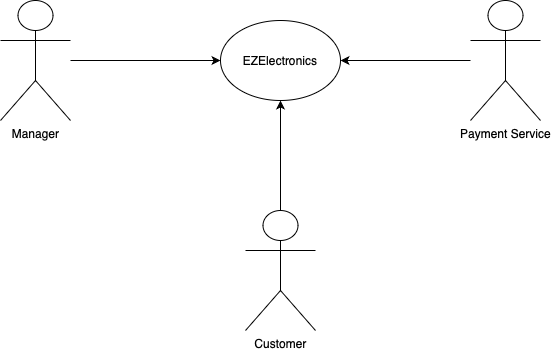
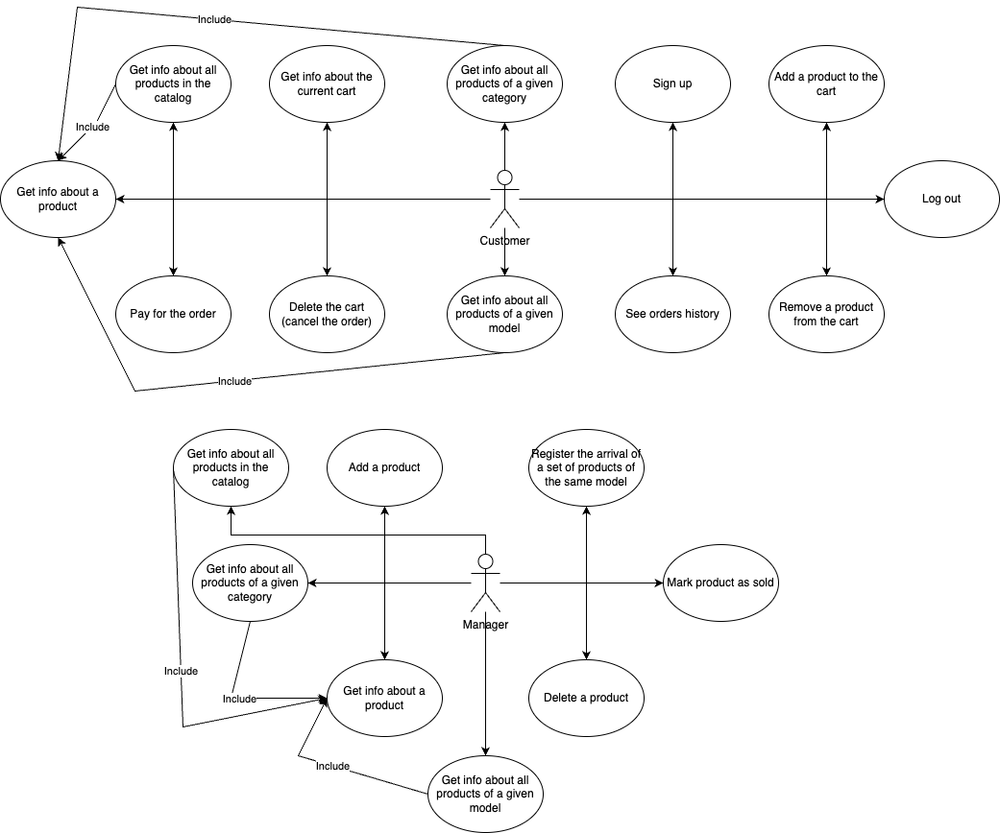
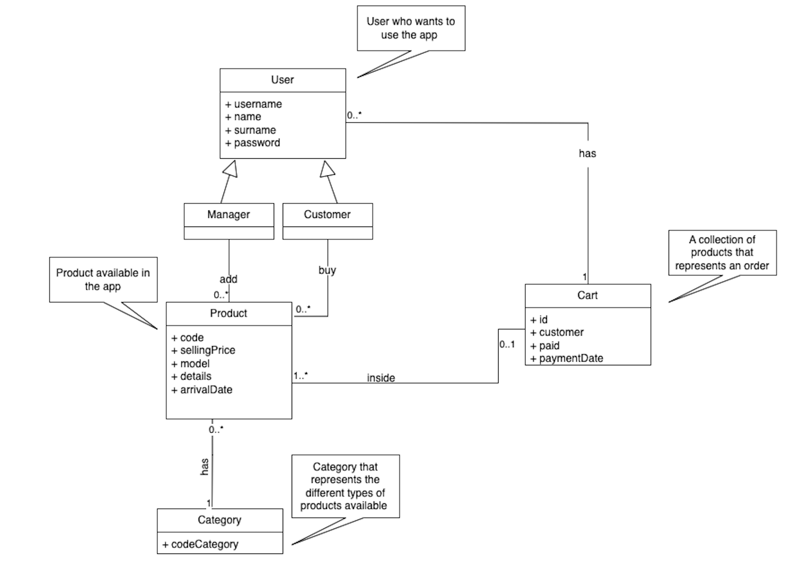
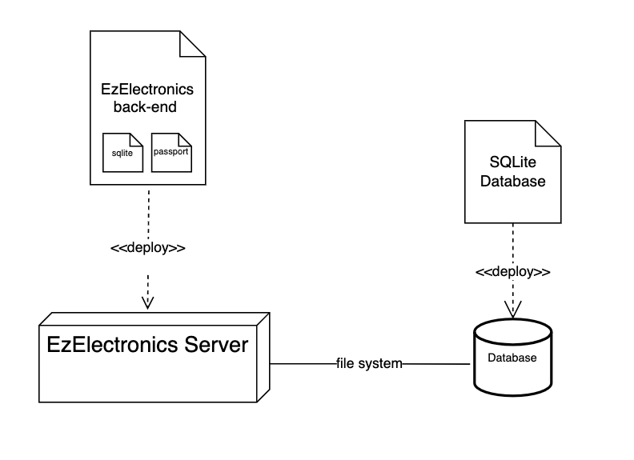

# Requirements Document - current EZElectronics

Date: 17-04-2024

Version: V1 - description of EZElectronics in CURRENT form (as received by teachers)

| Version number |                         Change                          |
| :------------: | :-----------------------------------------------------: |
|      V1.1      | Add stakeholders, context diagram, personas and stories |
|      V1.2      |                  Add UCD and scenarios                  |
|      V1.3      |                      Add glossary                       |
|      V1.4      |                     Add FR and NFR                      |

# Contents

- [Requirements Document - current EZElectronics](#requirements-document---current-ezelectronics)
- [Contents](#contents)
- [Informal description](#informal-description)
- [Stakeholders](#stakeholders)
- [Context Diagram and interfaces](#context-diagram-and-interfaces)
  - [Context Diagram](#context-diagram)
  - [Interfaces](#interfaces)
- [Stories and personas](#stories-and-personas)
  - [Persona 1 (Customer)](#persona-1-customer)
    - [Characteristics](#characteristics)
    - [Story](#story)
  - [Persona 2 (Manager)](#persona-2-manager)
    - [Characteristics](#characteristics-1)
    - [Story](#story-1)
- [Functional and non functional requirements](#functional-and-non-functional-requirements)
  - [Functional Requirements](#functional-requirements)
  - [Non Functional Requirements](#non-functional-requirements)
- [Use case diagram and use cases](#use-case-diagram-and-use-cases)
  - [Use case diagram](#use-case-diagram)
    - [Get info about a product, UC1](#get-info-about-a-product-uc1)
      - [Scenario 1.1](#scenario-11)
      - [Scenario 1.2](#scenario-12)
    - [Pay for the order, UC2](#pay-for-the-order-uc2)
      - [Scenario 2.1](#scenario-21)
      - [Scenario 2.2](#scenario-22)
    - [Delete the cart, UC3](#delete-the-cart-uc3)
      - [Scenario 3.1](#scenario-31)
      - [Scenario 3.2](#scenario-32)
    - [Get info about the current cart, UC4](#get-info-about-the-current-cart-uc4)
      - [Scenario 4.1](#scenario-41)
    - [Get info about all the products (of a given model or category), UC5](#get-info-about-all-the-products-of-a-given-model-or-category-uc5)
      - [Scenario 5.1](#scenario-51)
      - [Scenario 5.2](#scenario-52)
    - [See orders history, UC6](#see-orders-history-uc6)
      - [Scenario 6.1](#scenario-61)
    - [Add a product to the cart, UC7](#add-a-product-to-the-cart-uc7)
      - [Scenario 7.1](#scenario-71)
      - [Scenario 7.2](#scenario-72)
    - [Remove a product from the cart, UC8](#remove-a-product-from-the-cart-uc8)
      - [Scenario 8.1](#scenario-81)
      - [Scenario 8.2](#scenario-82)
    - [Sign up, UC9](#sign-up-uc9)
      - [Scenario 9.1](#scenario-91)
      - [Scenario 9.2](#scenario-92)
    - [Add a product to the catalog, UC10](#add-a-product-to-the-catalog-uc10)
      - [Scenario 10.1](#scenario-101)
      - [Scenario 10.2](#scenario-102)
      - [Scenario 10.3](#scenario-103)
    - [Mark a product as sold, UC11](#mark-a-product-as-sold-uc11)
      - [Scenario 11.1](#scenario-111)
      - [Scenario 11.2](#scenario-112)
      - [Scenario 11.3](#scenario-113)
    - [Register the arrival of a new set of products, UC12](#register-the-arrival-of-a-new-set-of-products-uc12)
      - [Scenario 12.1](#scenario-121)
      - [Scenario 12.2](#scenario-122)
- [Glossary](#glossary)
- [Deployment Diagram](#deployment-diagram)

# Informal description

EZElectronics (read EaSy Electronics) is a software application designed to help managers of electronics stores to manage their products and offer them to customers through a dedicated website. Managers can assess the available products, record new ones, and confirm purchases. Customers can see available products, add them to a cart and see the history of their past purchases.

# Stakeholders

| Stakeholder name |            Description            |
| :--------------: | :-------------------------------: |
|     Manager      |       Managers of the store       |
|     Customer     |      Customers of the store       |
| Payment service  | To offer ways to pay to the users |

# Context Diagram and interfaces

## Context Diagram

## Interfaces

|      Actor      | Logical Interface |             Physical Interface             |
| :-------------: | :---------------: | :----------------------------------------: |
|     Manager     |  PC, Smartphone   |       GUI (WebUI, Browser interface)       |
|    Customer     |  PC, Smartphone   |       GUI (WebUI, Browser interface)       |
| Payment Service |     Internet      | For ex: Stripe https://docs.stripe.com/api |

# Stories and personas

### Persona 1 (Customer)

#### Characteristics

Female, an office administration responsible for the office tools.

#### Story

She finds out she has to provide electronic devices for engineering team and for the office such as laptop, coffee
maker and etc.

She enters the website EZelectronics and adds all the products in her shopping cart, and completes
the order by paying.

### Persona 2 (Manager)

#### Characteristics

Young, male, manager in Ezelectronics

#### Story

He receives new stock of phones and he wants to add them to the website.
After login, he enters the product details and the price and updates the system.

# Functional and non functional requirements

## Functional Requirements

|  ID   |                 Description                 |
| :---: | :-----------------------------------------: |
|  FR1  |             Manage user account             |
| FR1.1 |         Login, start of the session         |
| FR1.2 |         Logout, end of the session          |
| FR1.3 |       Check credentials and user role       |
| FR1.4 |          Registration of the user           |
| FR1.5 | Manage errors in case of invalid input data |
|  FR2  |               Manage products               |
| FR2.3 |      Registration of the new products       |
| FR2.3 |       Categorization of the products        |
|  FR3  |           Managing shopping carts           |
| FR3.1 |          Add products to the cart           |
| FR3.2 |          Show products in the cart          |
| FR3.3 |  Calculate the total price of the products  |
| FR3.4 |        Payment of the shopping cart         |
|  FR4  |  Store all previous purchases of the user   |
| FR4.1 | Register the selling dates of the products  |

## Non Functional Requirements

|  ID  | Type (efficiency, reliability, ..) |                                      Description                                      |   Refers to   |
| :--: | :--------------------------------: | :-----------------------------------------------------------------------------------: | :-----------: |
| NFR1 |             Usability              | Should be used with no training by users including both roles in less than 10 minutes |    ALL FR     |
| NFR2 |             Efficiency             |                 Response time lower than 100ms in optimal conditions                  |    ALL FR     |
| NFR3 |            Availability            |                         Available for the 99.999% of the time                         |    ALL FR     |
| NFR4 |              Security              |                   Only authorized users with credentials can access                   |   FR1, FR2    |
| NFR5 |           Dependability            |       Previous purchases, products and carts available, consistent and secured        |   FR5. FR3    |
| NFR6 |            Correctness             |              Total price of cart must match the sum of products' prices               | FR3, FR4, FR5 |
| NFR7 |            Reliability             |              Less than 4 minor/medium defects per month and no data loss              |    ALL FR     |

# Use case diagram and use cases

## Use case diagram

### Get info about a product, UC1

| Actors Involved  |                            Customer (or Manager)                             |
| :--------------: | :--------------------------------------------------------------------------: |
|   Precondition   |                      Customer (or Manager) is logged in                      |
|  Post condition  | The information about the product are displayed to the Customer (or Manager) |
| Nominal Scenario |               Customer (or Manager) gets info about a product                |
|    Exceptions    |                    Product does not exist in the database                    |

#### Scenario 1.1

|  Scenario 1.1  |                      Get info about a product (nominal)                      |
| :------------: | :--------------------------------------------------------------------------: |
|  Precondition  |                      Customer (or Manager) is logged in                      |
| Post condition | The information about the product are displayed to the Customer (or Manager) |
|     Step#      |                                 Description                                  |
|       1        |          Customer (or Manager) requests information about a product          |
|       2        |            The website displays the information about the product            |

#### Scenario 1.2

|  Scenario 1.2  |                  Get info about a product (exception)                   |
| :------------: | :---------------------------------------------------------------------: |
|  Precondition  |                   Customer (or Manager) is logged in                    |
| Post condition |                 The website displays an error 404 page                  |
|     Step#      |                               Description                               |
|       1        | Customer (or Manager) requests information about a non existing product |
|       2        |                 The website displays an error 404 page                  |

### Pay for the order, UC2

| Actors Involved  |                              Customer                              |
| :--------------: | :----------------------------------------------------------------: |
|   Precondition   |            Customer is logged in and has an active cart            |
|  Post condition  |       The order has been paid and forwarded to the warehouse       |
| Nominal Scenario |                    Customer pays for the order                     |
|    Exceptions    | Customer does not have an active cart, or the active cart is empty |

#### Scenario 2.1

|  Scenario 2.1  |                Pay for the order (nominal)                 |
| :------------: | :--------------------------------------------------------: |
|  Precondition  |        Customer is logged in and has an active cart        |
| Post condition |   The order has been paid and forwarded to the warehouse   |
|     Step#      |                        Description                         |
|       1        |               Customer clicks on pay button                |
|       2        |        The payment provider handle the transactions        |
|       3        | The money is sent to the seller and the order is confirmed |

#### Scenario 2.2

|  Scenario 2.2  |                           Pay for the order (exception)                            |
| :------------: | :--------------------------------------------------------------------------------: |
|  Precondition  | Customer is logged in but does not have an active cart or the active cart is empty |
| Post condition |                       The website displays an error 404 page                       |
|     Step#      |                                    Description                                     |
|       1        |                           Customer clicks on pay button                            |
|       2        |                       The website displays an error 404 page                       |

### Delete the cart, UC3

| Actors Involved  |                   Customer                   |
| :--------------: | :------------------------------------------: |
|   Precondition   | Customer is logged in and has an active cart |
|  Post condition  |             The cart is deleted              |
| Nominal Scenario |          Customer deletes the cart           |
|    Exceptions    |    Customer does not have an active cart     |

#### Scenario 3.1

|  Scenario 3.1  |          Delete the cart (nominal)           |
| :------------: | :------------------------------------------: |
|  Precondition  | Customer is logged in and has an active cart |
| Post condition |             The cart is deleted              |
|     Step#      |                 Description                  |
|       1        |    Customer clicks on delete cart button     |
|       2        |             The cart is deleted              |

#### Scenario 3.2

|  Scenario 3.2  |              Delete the cart (exception)               |
| :------------: | :----------------------------------------------------: |
|  Precondition  | Customer is logged in but does not have an active cart |
| Post condition |         The website displays an error 404 page         |
|     Step#      |                      Description                       |
|       1        |         Customer clicks on delete cart button          |
|       2        |         The website displays an error 404 page         |

### Get info about the current cart, UC4

| Actors Involved  |                      Customer                       |
| :--------------: | :-------------------------------------------------: |
|   Precondition   |    Customer is logged in and has an active cart     |
|  Post condition  | The information about the current cart is displayed |
| Nominal Scenario |  Customer gets information about the current cart   |

#### Scenario 4.1

|  Scenario 4.1  |      Get info about the current cart (nominal)      |
| :------------: | :-------------------------------------------------: |
|  Precondition  |    Customer is logged in and has an active cart     |
| Post condition | The information about the current cart is displayed |
|     Step#      |                     Description                     |
|       1        |         Customer navigates to the cart page         |
|       2        | The information about the current cart is displayed |

### Get info about all the products (of a given model or category), UC5

| Actors Involved  |                                    Customer (or Manager)                                     |
| :--------------: | :------------------------------------------------------------------------------------------: |
|   Precondition   |                              Customer (or Manager) is logged in                              |
|  Post condition  |      The information about all the products (of a given model or category) is displayed      |
| Nominal Scenario | Customer (or Manager) gets information about all the products of a given model (or category) |
|     Variants     |                                    The sold flag is sent                                     |

#### Scenario 5.1

|  Scenario 5.1  |      Get info about all the products (of a given model or category) (nominal)      |
| :------------: | :--------------------------------------------------------------------------------: |
|  Precondition  |                         Customer (or Manager) is logged in                         |
| Post condition | The information about all the products (of a given model or category) is displayed |
|     Step#      |                                    Description                                     |
|       1        |                Customer (or Manager) navigates to the correct page                 |
|       2        | The information about all the products (of a given model or category) is displayed |

#### Scenario 5.2

|  Scenario 5.2  |                     Get info about all the products (of a given model or category) (variation)                      |
| :------------: | :-----------------------------------------------------------------------------------------------------------------: |
|  Precondition  |                                         Customer (or Manager) is logged in                                          |
| Post condition | The information about all the products (of a given model or category) that have (or haven't) been sold is displayed |
|     Step#      |                                                     Description                                                     |
|       1        |                                 Customer (or Manager) navigates to the correct page                                 |
|       2        | The information about all the products (of a given model or category) that have (or haven't) been sold is displayed |

### See orders history, UC6

| Actors Involved  |                        Customer                        |
| :--------------: | :----------------------------------------------------: |
|   Precondition   |                 Customer is logged in                  |
|  Post condition  | The information about all the past orders is displayed |
| Nominal Scenario |  Customer gets information about all the past orders   |

#### Scenario 6.1

|  Scenario 6.1  |              See orders history (nominal)              |
| :------------: | :----------------------------------------------------: |
|  Precondition  |                 Customer is logged in                  |
| Post condition | The information about all the past orders is displayed |
|     Step#      |                      Description                       |
|       1        |     Customer clicks navigates on the history page      |
|       2        | The information about all the past orders is displayed |

### Add a product to the cart, UC7

| Actors Involved  |                                               Customer                                                |
| :--------------: | :---------------------------------------------------------------------------------------------------: |
|   Precondition   |                                         Customer is logged in                                         |
|  Post condition  |                                   The product is added to the cart                                    |
| Nominal Scenario |                                   Customer adds a product the cart                                    |
|    Exceptions    | The product is already in another cart, the product does not exist, the product has already been sold |

#### Scenario 7.1

|  Scenario 7.1  |            Add a product to the cart (nominal)             |
| :------------: | :--------------------------------------------------------: |
|  Precondition  |                   Customer is logged in                    |
| Post condition |              The product is added to the cart              |
|     Step#      |                        Description                         |
|       1        | Customer clicks on the button to add a product to the cart |
|       2        |              The product is added to the cart              |

#### Scenario 7.2

|  Scenario 7.2  |           Add a product to the cart (exception)            |
| :------------: | :--------------------------------------------------------: |
|  Precondition  |                   Customer is logged in                    |
| Post condition |           The website displays an error 404 page           |
|     Step#      |                        Description                         |
|       1        | Customer clicks on the button to add a product to the cart |
|       2        |           The website displays an error 404 page           |

### Remove a product from the cart, UC8

| Actors Involved  |                                                               Customer                                                               |
| :--------------: | :----------------------------------------------------------------------------------------------------------------------------------: |
|   Precondition   |                                                        Customer is logged in                                                         |
|  Post condition  |                                                 The product is deleted from the cart                                                 |
| Nominal Scenario |                                               Customer removes a product from the cart                                               |
|    Exceptions    | Customer does not have an active cart, the product is not in the cart, the product does not exist, the product has already been sold |

#### Scenario 8.1

|  Scenario 8.1  |            Remove a product from the cart (nominal)             |
| :------------: | :-------------------------------------------------------------: |
|  Precondition  |                      Customer is logged in                      |
| Post condition |              The product is removed from the cart               |
|     Step#      |                           Description                           |
|       1        | Customer clicks on the button to remove a product from the cart |
|       2        |              The product is removed from the cart               |

#### Scenario 8.2

|  Scenario 8.2  |           Remove a product from the cart (exception)            |
| :------------: | :-------------------------------------------------------------: |
|  Precondition  |                      Customer is logged in                      |
| Post condition |             The website displays an error 404 page              |
|     Step#      |                           Description                           |
|       1        | Customer clicks on the button to remove a product from the cart |
|       2        |             The website displays an error 404 page              |

### Sign up, UC9

| Actors Involved  |                              Customer                              |
| :--------------: | :----------------------------------------------------------------: |
|   Precondition   |                                                                    |
|  Post condition  |                      The Customer is created                       |
| Nominal Scenario | Customer provides information for the account and click on sign up |
|    Exception     |                   Username is already registered                   |

#### Scenario 9.1

|  Scenario 9.1  |                         Sign up (nominal)                          |
| :------------: | :----------------------------------------------------------------: |
|  Precondition  |                                                                    |
| Post condition |                      The Customer is created                       |
|     Step#      |                            Description                             |
|       1        | Customer provides information for the account and click on sign up |
|       2        |                      The Customer is created                       |
|       3        |                    The log in page is displayed                    |

#### Scenario 9.2

|  Scenario 9.2  |                        Sign up (exception)                         |
| :------------: | :----------------------------------------------------------------: |
|  Precondition  |                                                                    |
| Post condition |               The website displays an error 409 page               |
|     Step#      |                            Description                             |
|       1        | Customer provides information for the account and click on sign up |
|       2        |                 The username is already registerd                  |
|       3        |                  The error 409 page is displayed                   |

### Add a product to the catalog, UC10

| Actors Involved  |                                  Manager                                   |
| :--------------: | :------------------------------------------------------------------------: |
|   Precondition   |                            Manager is logged in                            |
|  Post condition  |                    The product is added to the catalog                     |
| Nominal Scenario |           Manager provides information about the product to add            |
|    Exceptions    | The code is already registered, the arrival date is after the current date |

#### Scenario 10.1

| Scenario 10.1  |      Add a product to the catalog (nominal)      |
| :------------: | :----------------------------------------------: |
|  Precondition  |               Manager is logged in               |
| Post condition |       The product is added to the catalog        |
|     Step#      |                   Description                    |
|       1        | Manager provides information about a new product |
|       2        |       The product is added to the catalog        |

#### Scenario 10.2

| Scenario 10.2  | Add a product to the catalog, the product code is already registered (exception) |
| :------------: | :------------------------------------------------------------------------------: |
|  Precondition  |                               Manager is logged in                               |
| Post condition |                         The error 409 page is displayed                          |
|     Step#      |                                   Description                                    |
|       1        |                 Manager provides information about a new product                 |
|       2        |                     The product is not added to the database                     |
|       3        |                         The error 409 page is displayed                          |

#### Scenario 10.3

| Scenario 10.3  | Add a product to the catalog, the arrival date is later than current day (exception) |
| :------------: | :----------------------------------------------------------------------------------: |
|  Precondition  |                                 Manager is logged in                                 |
| Post condition |                              An error page is displayed                              |
|     Step#      |                                     Description                                      |
|       1        |                   Manager provides information about a new product                   |
|       2        |                       The product is not added to the database                       |
|       3        |                             The error page is displayed                              |

### Mark a product as sold, UC11

| Actors Involved  |                                                                Manager                                                                |
| :--------------: | :-----------------------------------------------------------------------------------------------------------------------------------: |
|   Precondition   |                                                         Manager is logged in                                                          |
|  Post condition  |                                                     The product is marked as sold                                                     |
| Nominal Scenario |                                                   Manager clicks on "mark as sold"                                                    |
|    Exceptions    | The product does not exist, the selling date is after today, the selling date is before the arrival date, the product is already sold |

#### Scenario 11.1

| Scenario 11.1  | Mark a product as sold (nominal) |
| :------------: | :------------------------------: |
|  Precondition  |       Manager is logged in       |
| Post condition |  The product is marked as sold   |
|     Step#      |           Description            |
|       1        | Manager clicks on "mark as sold" |
|       2        |  The product is marked as sold   |

#### Scenario 11.2

| Scenario 11.2  | Mark a product as sold, the product does not exist (exception) |
| :------------: | :------------------------------------------------------------: |
|  Precondition  |                      Manager is logged in                      |
| Post condition |                The error 404 page is displayed                 |
|     Step#      |                          Description                           |
|       1        |                Manager clicks on "mark as sold"                |
|       2        |                The error 404 page is displayed                 |

#### Scenario 11.3

| Scenario 11.3  | Mark a product as sold, the selling date is after today or before the arrival date, or the product is already sold (exception) |
| :------------: | :----------------------------------------------------------------------------------------------------------------------------: |
|  Precondition  |                                                      Manager is logged in                                                      |
| Post condition |                                                   An error page is displayed                                                   |
|     Step#      |                                                          Description                                                           |
|       1        |                                                Manager clicks on "mark as sold"                                                |
|       2        |                                                   An error page is displayed                                                   |

### Register the arrival of a new set of products, UC12

| Actors Involved  |                            Manager                             |
| :--------------: | :------------------------------------------------------------: |
|   Precondition   |                      Manager is logged in                      |
|  Post condition  |             The new set of products is registered              |
| Nominal Scenario | Manager provides the information about the new set of products |
|    Exceptions    |           The arrival date is after the current date           |

#### Scenario 12.1

| Scenario 12.1  |    Register the arrival of a new set of products (nominal)     |
| :------------: | :------------------------------------------------------------: |
|  Precondition  |                      Manager is logged in                      |
| Post condition |             The new set of products is registered              |
|     Step#      |                          Description                           |
|       1        | Manager provides the information about the new set of products |
|       2        |             The new set of products is registered              |

#### Scenario 12.2

| Scenario 12.2  |   Register the arrival of a new set of products (exception)    |
| :------------: | :------------------------------------------------------------: |
|  Precondition  |                      Manager is logged in                      |
| Post condition |                   An error page is displayed                   |
|     Step#      |                          Description                           |
|       1        | Manager provides the information about the new set of products |
|       2        |                   An error page is displayed                   |

# Glossary

# Deployment Diagram

