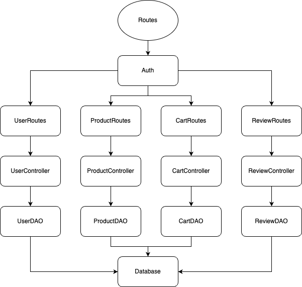
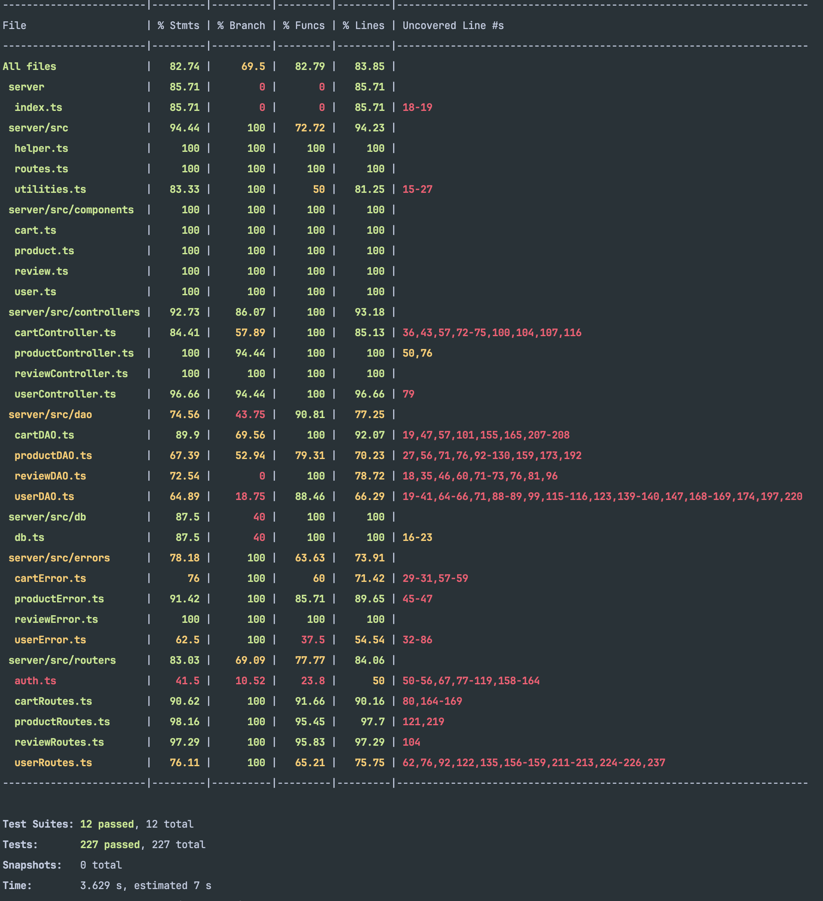

# Test Report

# Contents

- [Test Report](#test-report)
- [Contents](#contents)
- [Dependency graph](#dependency-graph)
- [Integration approach](#integration-approach)
- [Tests](#tests)
- [Coverage](#coverage)
  - [Coverage of FR](#coverage-of-fr)
  - [Coverage white box](#coverage-white-box)

# Dependency graph

# Integration approach

We worked with a bottom up approach, starting by unit testing the single components (DAOs, Controllers, Routes, Authentication) with mocks.

Then we wrote black-box integration tests for the various handlers.

Eventually we used the client to do manual test and make sure everything was working correctly.

- Step 1: unit tests for cartDAO.ts, productDAO.ts, reviewDAO.ts, userDAO.ts
- Step 2: unit tests for cartController.ts, productController.ts, reviewController.ts, userController.ts
- Step 3: unit tests for auth.ts, cartRoutes.ts, productRoutes.ts, reviewRoutes.ts, userRoutes.ts
- Step 4: integration tests for the whole routes
- Step 5: manual tests with the client

# Tests

<in the table below list the test cases defined For each test report the object tested, the test level (API, integration, unit) and the technique used to define the test case (BB/ eq partitioning, BB/ boundary, WB/ statement coverage, etc)> <split the table if needed>

| ID  |                                                               Test case name                                                                |             Object(s) tested              | Test level  | Technique used |
| :-- | :-----------------------------------------------------------------------------------------------------------------------------------------: | :---------------------------------------: | :---------: | :------------: |
| 1   |                                                           should delete all carts                                                           |       CartController deleteAllCarts       |    Unit     |       WB       |
| 2   |                                                   should throw an error if deletion fails                                                   |       CartController deleteAllCarts       |    Unit     |       WB       |
| 3   |                                                     should clear the cart if it exists                                                      |         CartController clearCart          |    Unit     |       WB       |
| 4   |                                          should throw CartNotFoundError if the cart does not exist                                          |         CartController clearCart          |    Unit     |       WB       |
| 5   |                                                          should retrieve all carts                                                          |        CartController getCartsAll         |    Unit     |       WB       |
| 6   |                                                  should throw an error if retrieval fails                                                   |        CartController getCartsAll         |    Unit     |       WB       |
| 7   |                                           should retrieve all paid carts for a specific customer                                            |        CartController getAllCarts         |    Unit     |       WB       |
| 8   |                                                  should throw an error if retrieval fails                                                   |        CartController getAllCarts         |    Unit     |       WB       |
| 9   |                                           should checkout the cart if it exists and has products                                            |        CartController checkoutCart        |    Unit     |       WB       |
| 10  |                                          should throw CartNotFoundError if the cart does not exist                                          |        CartController checkoutCart        |    Unit     |       WB       |
| 11  |                                              should throw EmptyCartError if the cart is empty                                               |        CartController checkoutCart        |    Unit     |       WB       |
| 12  |                                                      Should return a cart if it exists                                                      |          CartController getCart           |    Unit     |       WB       |
| 13  |                                           should return an empty Cart if the cart does not exist                                            |          CartController getCart           |    Unit     |       WB       |
| 14  |                                             should add a product to the cart if the cart exists                                             |         CartController addToCart          |    Unit     |       WB       |
| 15  |                                                should remove one product unit from the cart                                                 |        CartController getAllCarts         |    Unit     |       WB       |
| 16  |                                          should throw CartNotFoundError if the cart does not exist                                          |        CartController getAllCarts         |    Unit     |       WB       |
| 17  |                                    should throw ProductNotInCartError if the product is not in the cart                                     |        CartController getAllCarts         |    Unit     |       WB       |
| 18  |                                                   should throw an error if removal fails                                                    |        CartController getAllCarts         |    Unit     |       WB       |
| 19  |                                                             should return true                                                              |             registerProducts              |    Unit     |       WB       |
| 20  |                                                     should replace arrivalDate if null                                                      |             registerProducts              |    Unit     |       WB       |
| 21  |                                                             should return true                                                              |             deleteAllProducts             |    Unit     |       WB       |
| 22  |                                                         should return new quantity                                                          |           changeProductQuantity           |    Unit     |       WB       |
| 23  |                                                      should throw ProductNotFoundError                                                      |           changeProductQuantity           |    Unit     |       WB       |
| 24  |                                                should throw ChangeDateAfterCurrentDateError                                                 |           changeProductQuantity           |    Unit     |       WB       |
| 25  |                                                should throw ChangeDateBeforeArrivalDateError                                                |           changeProductQuantity           |    Unit     |       WB       |
| 26  |                                                     should return an array of products                                                      |                getProducts                |    Unit     |       WB       |
| 27  |                                                          should filter by category                                                          |                getProducts                |    Unit     |       WB       |
| 28  |                                                           should filter by model                                                            |                getProducts                |    Unit     |       WB       |
| 29  |                                                        should return an empty array                                                         |                getProducts                |    Unit     |       WB       |
| 30  |                                                      should throw ProductNotFoundError                                                      |                getProducts                |    Unit     |       WB       |
| 31  |                                                     should return an array of products                                                      |           getAvailableProducts            |    Unit     |       WB       |
| 32  |                                                          should filter by category                                                          |           getAvailableProducts            |    Unit     |       WB       |
| 33  |                                                           should filter by model                                                            |           getAvailableProducts            |    Unit     |       WB       |
| 34  |                                                        should return an empty array                                                         |           getAvailableProducts            |    Unit     |       WB       |
| 35  |                                                      should throw ProductNotFoundError                                                      |           getAvailableProducts            |    Unit     |       WB       |
| 36  |                                                             should return true                                                              |               deleteProduct               |    Unit     |       WB       |
| 37  |                                                      should throw ProductNotFoundError                                                      |               deleteProduct               |    Unit     |       WB       |
| 38  |                                                should return the new quantity of the product                                                |                sellProduct                |    Unit     |       WB       |
| 39  |                                                      should throw ProductNotFoundError                                                      |                sellProduct                |    Unit     |       WB       |
| 40  |                                                           should throw DateError                                                            |                sellProduct                |    Unit     |       WB       |
| 41  |                                                     should throw EmptyProductStockError                                                     |                sellProduct                |    Unit     |       WB       |
| 42  |                                                      should throw LowProductStockError                                                      |                sellProduct                |    Unit     |       WB       |
| 43  |                                                      should throw ProductNotFoundError                                                      |             getProductReviews             |    Unit     |       WB       |
| 44  |                                                       should return a list of reviews                                                       |             getProductReviews             |    Unit     |       WB       |
| 45  |                                                      should throw ProductNotFoundError                                                      |               deleteReview                |    Unit     |       WB       |
| 46  |                                                      should throw NoReviewProductError                                                      |               deleteReview                |    Unit     |       WB       |
| 47  |                                                should return a promise that resolve nothing                                                 |               deleteReview                |    Unit     |       WB       |
| 48  |                                                should return a promise that resolve nothing                                                 |             deleteAllReviews              |    Unit     |       WB       |
| 49  |                                                      should throw ExistingReviewError                                                       |                 addReview                 |    Unit     |       WB       |
| 50  |                                                      should throw ProductNotFoundError                                                      |                 addReview                 |    Unit     |       WB       |
| 51  |                                                      should throw ProductNotFoundError                                                      |          deleteReviewsOfProduct           |    Unit     |       WB       |
| 52  |                                                should return a promise that resolve nothing                                                 |          deleteReviewsOfProduct           |    Unit     |       WB       |
| 53  |                                                            It should return true                                                            |          deleteReviewsOfProduct           |    Unit     |       WB       |
| 54  |                                                     It should return an array of users                                                      |                 getUsers                  |    Unit     |       WB       |
| 55  |                                               Should return the user with the given username                                                |             getUserByUsername             |    Unit     |       WB       |
| 56  |                                               Should return the user with the given username                                                |             getUserByUsername             |    Unit     |       WB       |
| 57  |                                                     Should return UnauthorizedUserError                                                     |             getUserByUsername             |    Unit     |       WB       |
| 58  |                                                     Should return UnauthorizedUserError                                                     |             getUserByUsername             |    Unit     |       WB       |
| 59  |                                                     It should return an array of users                                                      |              getUsersByRole               |    Unit     |       WB       |
| 60  |                                                       Should return the user updated                                                        |                UpdateUser                 |    Unit     |       WB       |
| 61  |                                                       Should return the user updated                                                        |        Admin change other NonAdmin        |    Unit     |       WB       |
| 62  |                                                       Should return UserNotFoundError                                                       |                UpdateUser                 |    Unit     |       WB       |
| 63  |                                                Should return BirthDateAfterCurrentDate Error                                                |                UpdateUser                 |    Unit     |       WB       |
| 64  |                                                     Should return UnauthorizedUserError                                                     |                UpdateUser                 |    Unit     |       WB       |
| 65  |                                                     Should return UnauthorizedUserError                                                     |      Admin try to update other Admin      |    Unit     |       WB       |
| 66  |                                                           It should resolve true                                                            |       Delete All users (Non Admin)        |    Unit     |       WB       |
| 67  |                                                              It should reject                                                               |       Delete All users (Non Admin)        |    Unit     |       WB       |
| 68  |                                                           It should resolve true                                                            |          Customer delete itself           |    Unit     |       WB       |
| 69  |                                                           It should resolve true                                                            |         Admin delete NonAdminUser         |    Unit     |       WB       |
| 70  |                                                 It should reject with UnauthorizedUserError                                                 |        Admin delete another Admin         |    Unit     |       WB       |
| 71  |                                                 It should reject with UnauthorizedUserError                                                 |     NonAdminUser delete another User      |    Unit     |       WB       |
| 72  |                                                   It should reject with UserNotFoundError                                                   |                Delete User                |    Unit     |       WB       |
| 73  |                                                Should delete all carts and products in cart                                                 |          CartDAO deleteAllCarts           |    Unit     |       WB       |
| 74  |                                                     should clear the cart if it exists                                                      |             CartDAO clearCart             |    Unit     |       WB       |
| 75  |                                                          should retrieve all carts                                                          |            CartDAO getCartsAll            |    Unit     |       WB       |
| 76  |                                                  should throw an error if retrieval fails                                                   |            CartDAO getCartsAll            |    Unit     |       WB       |
| 77  |                                                  should throw an error if retrieval fails                                                   |            CartDAO getAllCarts            |    Unit     |       WB       |
| 78  |                                           should checkout the cart if it exists and has products                                            |           CartDAO checkoutCart            |    Unit     |       WB       |
| 79  |                                              should throw EmptyCartError if the cart is empty                                               |           CartDAO checkoutCart            |    Unit     |       WB       |
| 80  |                                                      Should return a cart if it exists                                                      |              CartDAO getCart              |    Unit     |       WB       |
| 81  |                                         Should return empty cart object if the cart does not exist                                          |              CartDAO getCart              |    Unit     |       WB       |
| 82  |                                                  should add a product to an existing cart                                                   |         CartDAO addProductToCart          |    Unit     |       WB       |
| 83  |                                   should create a new cart and add the product if the cart does not exist                                   |         CartDAO addProductToCart          |    Unit     |       WB       |
| 84  |                                                should remove one product unit from the cart                                                 |            CartDAO getAllCarts            |    Unit     |       WB       |
| 85  |                                          should throw CartNotFoundError if the cart does not exist                                          |            CartDAO getAllCarts            |    Unit     |       WB       |
| 86  |                                    should throw ProductNotInCartError if the product is not in the cart                                     |            CartDAO getAllCarts            |    Unit     |       WB       |
| 87  |                                                    resolves true if product is inserted                                                     |               createProduct               |    Unit     |       WB       |
| 88  |                                    throws ProductAlreadyExistsError if product is already present in DB                                     |               createProduct               |    Unit     |       WB       |
| 89  |                                                     resolves true if product is updated                                                     |               updateProduct               |    Unit     |       WB       |
| 90  |                                                        throws exception if DB error                                                         |               updateProduct               |    Unit     |       WB       |
| 91  |                                                  resolves true if all products are deleted                                                  |             deleteAllProducts             |    Unit     |       WB       |
| 92  |                                                    resolves an array of Product objects                                                     |                getProducts                |    Unit     |       WB       |
| 93  |                                          resolves an array of Product objects filtered by category                                          |                getProducts                |    Unit     |       WB       |
| 94  |                                           resolves an array of Product objects filtered by model                                            |                getProducts                |    Unit     |       WB       |
| 95  |                                                    resolves an array of Product objects                                                     |           getAvailableProducts            |    Unit     |       WB       |
| 96  |                                          resolves an array of Product objects filtered by category                                          |           getAvailableProducts            |    Unit     |       WB       |
| 97  |                                           resolves an array of Product objects filtered by model                                            |           getAvailableProducts            |    Unit     |       WB       |
| 98  |                                                     resolves true if product is deleted                                                     |               deleteProduct               |    Unit     |       WB       |
| 99  |                                                      resolves true if product is sold                                                       |                sellProduct                |    Unit     |       WB       |
| 100 |                                  resolve a list of reviews if model matches with present models in the db                                   |               getAllByModel               |    Unit     |       WB       |
| 101 |                                                  should resolve the number of deleted rows                                                  |               deleteByUser                |    Unit     |       WB       |
| 102 |                                                  should resolve the number of deleted rows                                                  |                 deleteAll                 |    Unit     |       WB       |
| 103 |                                                     resolve true if review is inserted                                                      |               create review               |    Unit     |       WB       |
| 104 |                                                  should resolve the number of deleted rows                                                  |             deleteAllByModel              |    Unit     |       WB       |
| 105 |                                                           It should resolve true                                                            |             deleteAllByModel              |    Unit     |       WB       |
| 106 |                                            It should return an array of users with the userList                                             |                 getUsers                  |    Unit     |       WB       |
| 107 |                                            It should return the user with the specified username                                            |             getUserByUsername             |    Unit     |       WB       |
| 108 |                                        It should return UserNotFoundError if the user does not exist                                        |             getUserByUsername             |    Unit     |       WB       |
| 109 |                                         It should return an array of users with the specified role                                          |              getUsersByRole               |    Unit     |       WB       |
| 110 |                                                        It should resolve with a user                                                        |                updateUser                 |    Unit     |       WB       |
| 111 |                                                           It should resolve true                                                            |       Delete All users (Non Admin)        |    Unit     |       WB       |
| 112 |                                                          It should reject an error                                                          |       Delete All users (Non Admin)        |    Unit     |       WB       |
| 113 |                                                           It should resolve true                                                            |     Delete specific user by username      |    Unit     |       WB       |
| 114 |                                                          It should reject an error                                                          |     Delete specific user by username      |    Unit     |       WB       |
| 115 |                                                  should return 401 for unauthorized access                                                  |         CartRoutes DELETE /carts          |    Unit     |       WB       |
| 116 |                                                        should clear the current cart                                                        |     CartRoutes DELETE /carts/current      |    Unit     |       WB       |
| 117 |                                                should return 404 if the cart does not exist                                                 |     CartRoutes DELETE /carts/current      |    Unit     |       WB       |
| 118 |                                                  should return 401 for unauthorized access                                                  |     CartRoutes DELETE /carts/current      |    Unit     |       WB       |
| 119 |                                                          should retrieve all carts                                                          |           CartRoutes GET /carts           |    Unit     |       WB       |
| 120 |                                                    should return 503 if retrieval fails                                                     |           CartRoutes GET /carts           |    Unit     |       WB       |
| 121 |                                                  should return 401 for unauthorized access                                                  |           CartRoutes GET /carts           |    Unit     |       WB       |
| 122 |                                        should retrieve the history of the logged in customers carts                                         |           CartRoutes GET /carts           |    Unit     |       WB       |
| 123 |                                                    should return 500 if retrieval fails                                                     |           CartRoutes GET /carts           |    Unit     |       WB       |
| 124 |                                                  should return 401 for unauthorized access                                                  |           CartRoutes GET /carts           |    Unit     |       WB       |
| 125 |                                                          should checkout the cart                                                           |          CartRoutes PATCH /carts          |    Unit     |       WB       |
| 126 |                                                should return 404 if the cart does not exist                                                 |          CartRoutes PATCH /carts          |    Unit     |       WB       |
| 127 |                                                   should return 400 if the cart is empty                                                    |          CartRoutes PATCH /carts          |    Unit     |       WB       |
| 128 |                                                  should return 401 for unauthorized access                                                  |          CartRoutes PATCH /carts          |    Unit     |       WB       |
| 129 |                                                      should return a cart if it exists                                                      |           CartRoutes GET /carts           |    Unit     |       WB       |
| 130 |                                           should return any empty cart if the cart does not exist                                           |           CartRoutes GET /carts           |    Unit     |       WB       |
| 131 |                                              should return 404 if none of cart does not exist                                               |           CartRoutes GET /carts           |    Unit     |       WB       |
| 132 |                                                  should return 401 for unauthorized access                                                  |           CartRoutes GET /carts           |    Unit     |       WB       |
| 133 |                                                      should add a product to the cart                                                       |          CartRoutes POST /carts           |    Unit     |       WB       |
| 134 |                                             should return 422 if product model is not provided                                              |          CartRoutes POST /carts           |    Unit     |       WB       |
| 135 |                                                  should return 401 for unauthorized access                                                  |          CartRoutes POST /carts           |    Unit     |       WB       |
| 136 |                                                should remove one product unit from the cart                                                 |          CartRoutes POST /carts           |    Unit     |       WB       |
| 137 |                                                should return 404 if the cart does not exist                                                 |          CartRoutes POST /carts           |    Unit     |       WB       |
| 138 |                                             should return 404 if the product is not in the cart                                             |          CartRoutes POST /carts           |    Unit     |       WB       |
| 139 |                                                     should return 500 if removal fails                                                      |          CartRoutes POST /carts           |    Unit     |       WB       |
| 140 |                                                  should return 401 for unauthorized access                                                  |          CartRoutes POST /carts           |    Unit     |       WB       |
| 141 |                                                      should return a 200 success code                                                       |       POST /ezelectronics/products        |    Unit     |       WB       |
| 142 |                                           should return a 200 success code with null arrivalDate                                            |       POST /ezelectronics/products        |    Unit     |       WB       |
| 143 |                                         should return a 401 response code if user is not a manager                                          |       POST /ezelectronics/products        |    Unit     |       WB       |
| 144 |                                       should return a 409 response code if the product already exists                                       |       POST /ezelectronics/products        |    Unit     |       WB       |
| 145 |                                     should return a 422 response code if the arrivalDate is after today                                     |       POST /ezelectronics/products        |    Unit     |       WB       |
| 146 |                                                       should return a 401 status code                                                       |             DELETE /products              |    Unit     |       WB       |
| 147 |                                                      should return a 200 success code                                                       |             DELETE /products              |    Unit     |       WB       |
| 148 |                                              should return a 200 success code with changeDate                                               |   PATCH /ezelectronics/products/:model    |    Unit     |       WB       |
| 149 |                                             should return a 200 success code without changeDate                                             |   PATCH /ezelectronics/products/:model    |    Unit     |       WB       |
| 150 |                                       should return a 404 response code if the product does not exist                                       |   PATCH /ezelectronics/products/:model    |    Unit     |       WB       |
| 151 |                                          should return a 401 status code if not admin nor manager                                           |        GET /ezelectronics/products        |    Unit     |       WB       |
| 152 |                                                      should return a 200 success code                                                       |        GET /ezelectronics/products        |    Unit     |       WB       |
| 153 |                                           should return a 200 success code with a category filter                                           |        GET /ezelectronics/products        |    Unit     |       WB       |
| 154 |                                            should return a 200 success code with a model filter                                             |        GET /ezelectronics/products        |    Unit     |       WB       |
| 155 |                                     should return a 404 response code if ProductNotFoundError is thrown                                     |        GET /ezelectronics/products        |    Unit     |       WB       |
| 156 |                                              should return a 401 status code if not logged in                                               |   GET /ezelectronics/products/available   |    Unit     |       WB       |
| 157 |                                                      should return a 200 success code                                                       |   GET /ezelectronics/products/available   |    Unit     |       WB       |
| 158 |                                           should return a 200 success code with a category filter                                           |   GET /ezelectronics/products/available   |    Unit     |       WB       |
| 159 |                                            should return a 200 success code with a model filter                                             |   GET /ezelectronics/products/available   |    Unit     |       WB       |
| 160 |                                     should return a 404 response code if ProductNotFoundError is thrown                                     |   GET /ezelectronics/products/available   |    Unit     |       WB       |
| 161 |                                                      should return a 200 success code                                                       |   DELETE /ezelectronics/products/:model   |    Unit     |       WB       |
| 162 |                                   should return a 401 response code if user is not a manager nor an admin                                   |   DELETE /ezelectronics/products/:model   |    Unit     |       WB       |
| 163 |                                       should return a 404 response code if the product does not exist                                       |   DELETE /ezelectronics/products/:model   |    Unit     |       WB       |
| 164 |                                                      should return a 200 success code                                                       | PATCH /ezelectronics/products/:model/sell |    Unit     |       WB       |
| 165 |                                           should return a 200 success code with empty sellingDate                                           | PATCH /ezelectronics/products/:model/sell |    Unit     |       WB       |
| 166 |                                         should return a 401 response code if user is not a manager                                          | PATCH /ezelectronics/products/:model/sell |    Unit     |       WB       |
| 167 |                                       should return a 401 response code if user is not authenticated                                        |     GET /ezelectronics/reviews/:model     |    Unit     |       WB       |
| 168 |                                                       should return 200 success code                                                        |     GET /ezelectronics/reviews/:model     |    Unit     |       WB       |
| 169 |                                         should return a 404 error code if if model does not exists                                          |     GET /ezelectronics/reviews/:model     |    Unit     |       WB       |
| 170 |                                          should return a 401 response code if user is not customer                                          |    DELETE ezelectronics/reviews/:model    |    Unit     |       WB       |
| 171 |                                                       should return 200 success code                                                        |    DELETE ezelectronics/reviews/:model    |    Unit     |       WB       |
| 172 |                                            should return 404 error code if model does not exists                                            |    DELETE ezelectronics/reviews/:model    |    Unit     |       WB       |
| 173 |                 should return 404 error code if the current user does not have a review for the product identified by model                 |    DELETE ezelectronics/reviews/:model    |    Unit     |       WB       |
| 174 |                                   should return a 401 response code if user is not a manage nor an admin                                    |       DELETE ezelectronics/reviews        |    Unit     |       WB       |
| 175 |                                                       should return 200 success code                                                        |       DELETE ezelectronics/reviews        |    Unit     |       WB       |
| 176 |                                         should return a 401 response code if user is not a customer                                         |        POST /ezelectronics/:model         |    Unit     |       WB       |
| 177 |                                                       A validation error should occur                                                       |        POST /ezelectronics/:model         |    Unit     |       WB       |
| 178 |                                                       should return 200 success code                                                        |        POST /ezelectronics/:model         |    Unit     |       WB       |
| 179 |                                             should return a 404 error if model does not exists                                              |        POST /ezelectronics/:model         |    Unit     |       WB       |
| 180 |                        should return a 409 error if there is an existing review for the product made by the customer                        |        POST /ezelectronics/:model         |    Unit     |       WB       |
| 181 |                                   should return a 401 response code if user is not a manage nor an admin                                    |  DELETE ezelectronics/reviews/:model/all  |    Unit     |       WB       |
| 182 |                                                       should return 200 success code                                                        |  DELETE ezelectronics/reviews/:model/all  |    Unit     |       WB       |
| 183 |                                            should return 404 error code if model does not exist                                             |  DELETE ezelectronics/reviews/:model/all  |    Unit     |       WB       |
| 184 |                                                     It should return a 200 success code                                                     |  DELETE ezelectronics/reviews/:model/all  |    Unit     |       WB       |
| 185 |                                           should return a 401 response code if user is not Admin                                            |         GET /ezelectronics/users          |    Unit     |       WB       |
| 186 |                                                      should return a 200 success code                                                       |         GET /ezelectronics/users          |    Unit     |       WB       |
| 187 |                                                       A validation error should occur                                                       |              POST /sessions               |    Unit     |       WB       |
| 188 |                                                            Unauthenticated user                                                             |         DELETE /sessions/current          |    Unit     |       WB       |
| 189 |                                                            Unauthenticated user                                                             |           GET /sessions/current           |    Unit     |       WB       |
| 190 |                                                      should return a 200 success code                                                       |    GET /ezelectronics/users/:username     |    Unit     |       WB       |
| 191 |                                            should return a 401 unauthorized code if not LoggedIn                                            |    GET /ezelectronics/users/:username     |    Unit     |       WB       |
| 192 |                                                 should return a 404 if user does not exist                                                  |    GET /ezelectronics/users/:username     |    Unit     |       WB       |
| 193 |                                           should return a 401 response code if user is not Admin                                            |   GET /ezelectronics/users/roles/:role    |    Unit     |       WB       |
| 194 |                                                      should return a 200 success code                                                       |   GET /ezelectronics/users/roles/:role    |    Unit     |       WB       |
| 195 |                                         should return a 422 response code if the role is not valid                                          |   GET /ezelectronics/users/roles/:role    |    Unit     |       WB       |
| 196 |                                            should return a 401 unauthorized code if not LoggedIn                                            |   PATCH /ezelectronics/users/:username    |    Unit     |       WB       |
| 197 |                                                     It should return a 200 success code                                                     |        DELETE /ezelectronics/users        |    Unit     |       WB       |
| 198 |                                                  It should return a 401 unauthorized code                                                   |        DELETE /ezelectronics/users        |    Unit     |       WB       |
| 199 |                                                      should return a 200 success code                                                       |   DELETE /ezelectronics/users/:username   |    Unit     |       WB       |
| 200 |                                                    should return a 401 unauthorized code                                                    |   DELETE /ezelectronics/users/:username   |    Unit     |       WB       |
| 201 |                                              It should return an empty cart for a new customer                                              |                GET /carts                 | Integration |       BB       |
| 202 |                                                     It should add a product to the cart                                                     |                POST /carts                | Integration |       BB       |
| 203 |                                It should return a 404 error if model does not represent an existing product                                 |                POST /carts                | Integration |       BB       |
| 204 |                          It should return a 409 error if model represents a product whose available quantity is 0                           |                POST /carts                | Integration |       BB       |
| 205 |                                                    Should simulate payment for the cart                                                     |        PATCH /ezelectronics/carts         | Integration |       BB       |
| 206 |                        It should return a 404 error if there is no information about an unpaid cart in the database                         |        PATCH /ezelectronics/carts         | Integration |       BB       |
| 207 |                          It should return a 400 error if there is an unpaid cart but the cart contains no product                           |        PATCH /ezelectronics/carts         | Integration |       BB       |
| 208 |            It should return a 409 error if there is at least one product in the cart whose available quantity in the stock is 0             |        PATCH /ezelectronics/carts         | Integration |       BB       |
| 209 | It should return a 409 error if there is at least one product in the cart whose quantity is higher than the available quantity in the stock |        PATCH /ezelectronics/carts         | Integration |       BB       |
| 210 |                                                 It should return the history of past orders                                                 |            GET /carts/history             | Integration |       BB       |
| 211 |                                                  It should remove a product from the cart                                                   |       DELETE /carts/products/:model       | Integration |       BB       |
| 212 |                                       It should return a 404 error if the product is not in the cart                                        |       DELETE /carts/products/:model       | Integration |       BB       |
| 213 |                                                      It should empty the current cart                                                       |           DELETE /carts/current           | Integration |       BB       |
| 214 |                          It should return a 404 error if there is no information about an unpaid cart for the user                          |           DELETE /carts/current           | Integration |       BB       |
| 215 |                                              It should delete all existing carts of all users                                               |               DELETE /carts               | Integration |       BB       |
| 216 |                                      It should return a 401 error if the user is not Admin or Manager                                       |               DELETE /carts               | Integration |       BB       |
| 217 |                                      It should return a 401 error if the user is not Admin or Manager                                       |              GET /carts/all               | Integration |       BB       |
| 218 |                                                   It should return all carts of all users                                                   |              GET /carts/all               | Integration |       BB       |
| 219 |                                                     It should return a 401 status code                                                      |       POST /ezelectronics/products        | Integration |       BB       |
| 220 |                                                     It should return a 200 status code                                                      |       POST /ezelectronics/products        | Integration |       BB       |
| 221 |                                          It should return a 200 status code with empty arrivalDate                                          |       POST /ezelectronics/products        | Integration |       BB       |
| 222 |                                                     It should return a 409 status code                                                      |       POST /ezelectronics/products        | Integration |       BB       |
| 223 |                                                     It should return a 401 status code                                                      |   PATCH /ezelectronics/products/:model    | Integration |       BB       |
| 224 |                                                     It should return a 200 status code                                                      |   PATCH /ezelectronics/products/:model    | Integration |       BB       |
| 225 |                                          It should return a 200 status code with empty changeDate                                           |   PATCH /ezelectronics/products/:model    | Integration |       BB       |
| 226 |                                       It should return a 400 status code if changeDate is after today                                       |   PATCH /ezelectronics/products/:model    | Integration |       BB       |
| 227 |                                   It should return a 400 status code if changeDate is before arrivalDate                                    |   PATCH /ezelectronics/products/:model    | Integration |       BB       |
| 228 |                                                     It should return a 401 status code                                                      | PATCH /ezelectronics/products/:model/sell | Integration |       BB       |
| 229 |                                                     It should return a 200 status code                                                      | PATCH /ezelectronics/products/:model/sell | Integration |       BB       |
| 230 |                                          It should return a 200 status code with empty sellingDate                                          | PATCH /ezelectronics/products/:model/sell | Integration |       BB       |
| 231 |                                                     It should return a 404 status code                                                      | PATCH /ezelectronics/products/:model/sell | Integration |       BB       |
| 232 |                                                     It should return a 409 status code                                                      | PATCH /ezelectronics/products/:model/sell | Integration |       BB       |
| 233 |                                                     It should return a 400 status code                                                      | PATCH /ezelectronics/products/:model/sell | Integration |       BB       |
| 234 |                                                     It should return a 401 status code                                                      |        GET /ezelectronics/products        | Integration |       BB       |
| 235 |                                                     It should return a 200 status code                                                      |        GET /ezelectronics/products        | Integration |       BB       |
| 236 |                                            It should return a 200 status code with model filter                                             |        GET /ezelectronics/products        | Integration |       BB       |
| 237 |                                           It should return a 200 status code with category filter                                           |        GET /ezelectronics/products        | Integration |       BB       |
| 238 |                                                     It should return a 401 status code                                                      |   GET /ezelectronics/products/available   | Integration |       BB       |
| 239 |                                                     It should return a 200 status code                                                      |   GET /ezelectronics/products/available   | Integration |       BB       |
| 240 |                                            It should return a 200 status code with model filter                                             |   GET /ezelectronics/products/available   | Integration |       BB       |
| 241 |                                           It should return a 200 status code with category filter                                           |   GET /ezelectronics/products/available   | Integration |       BB       |
| 242 |                                                     It should return a 401 status code                                                      |   DELETE /ezelectronics/products/:model   | Integration |       BB       |
| 243 |                                                     It should return a 200 status code                                                      |   DELETE /ezelectronics/products/:model   | Integration |       BB       |
| 244 |                                                     It should return a 404 status code                                                      |   DELETE /ezelectronics/products/:model   | Integration |       BB       |
| 245 |                                          It should return a 200 success code and add a new review                                           |           POST /reviews/:model            | Integration |       BB       |
| 246 |                      It should return a 404 error code if model does not represent an existing product in the database                      |           POST /reviews/:model            | Integration |       BB       |
| 247 |                    It should return a 409 error code if there is an existing review for the product made by the customer                    |           POST /reviews/:model            | Integration |       BB       |
| 248 |                         It should return a 422 error code if at least one request body parameter is empty/incorrect                         |           POST /reviews/:model            | Integration |       BB       |
| 249 |                                                     It should return a 200 success code                                                     |            GET /reviews/:model            | Integration |       BB       |
| 250 |                      It should return a 404 error code if model does not represent an existing product in the database                      |            GET /reviews/:model            | Integration |       BB       |
| 251 |                                      It should return a 401 error code if the user is unauthenticated                                       |            GET /reviews/:model            | Integration |       BB       |
| 252 |                                                     It should return a 200 success code                                                     |          DELETE /reviews/:model           | Integration |       BB       |
| 253 |                      It should return a 404 error code if model does not represent an existing product in the database                      |          DELETE /reviews/:model           | Integration |       BB       |
| 254 |              It should return a 404 error code if the current user does not have a review for the product identified by model               |          DELETE /reviews/:model           | Integration |       BB       |
| 255 |                                      It should return a 401 error code if the user is unauthenticated                                       |          DELETE /reviews/:model           | Integration |       BB       |
| 256 |                                   It should return a 401 error code if the current user is not authorized                                   |          DELETE /reviews/:model           | Integration |       BB       |
| 257 |                                                     It should return a 200 success code                                                     |        DELETE /reviews/:model/all         | Integration |       BB       |
| 258 |                      It should return a 404 error code if model does not represent an existing product in the database                      |        DELETE /reviews/:model/all         | Integration |       BB       |
| 259 |                                   It should return a 401 error code if the current user is not authorized                                   |        DELETE /reviews/:model/all         | Integration |       BB       |
| 260 |                                                     It should return a 200 success code                                                     |              DELETE /reviews              | Integration |       BB       |
| 261 |                                   It should return a 401 error code if the current user is not authorized                                   |              DELETE /reviews              | Integration |       BB       |
| 262 |                                                     It should return a 200 status code                                                      |       POST /ezelectronics/sessions        | Integration |       BB       |
| 263 |                                      It should return a 401 status code if the username does not exist                                      |       POST /ezelectronics/sessions        | Integration |       BB       |
| 264 |                     It should return a 401 status code if the password provided does not match the one in the database                      |       POST /ezelectronics/sessions        | Integration |       BB       |
| 265 |                                                     It should return a 200 status code                                                      |  DELETE /ezelectronics/sessions/current   | Integration |       BB       |
| 266 |                                                     It should return a 200 status code                                                      |    GET /ezelectronics/sessions/current    | Integration |       BB       |
| 267 |                                                                 POST /users                                                                 |                POST /users                | Integration |       BB       |
| 268 |                                                      POST /users - User already exists                                                      |                POST /users                | Integration |       BB       |
| 269 |                                                                 GET /users                                                                  |                GET /users                 | Integration |       BB       |
| 270 |                                                           GET /users - Not Admin                                                            |                GET /users                 | Integration |       BB       |
| 271 |                                                            GET /users/:username                                                             |           GET /users/:username            | Integration |       BB       |
| 272 |                                                      GET /users/:username - Not Admin                                                       |           GET /users/:username            | Integration |       BB       |
| 273 |                                                    DEL /users/:username - Not Authorized                                                    |           DEL /users/:username            | Integration |       BB       |
| 274 |                                                 DEL /users/:username - User does not exist                                                  |           DEL /users/:username            | Integration |       BB       |
| 275 |                                                            DEL /users/:username                                                             |           DEL /users/:username            | Integration |       BB       |
| 276 |                                                           DEL /users - Not Admin                                                            |                DEL /users                 | Integration |       BB       |
| 277 |                                                                 DEL /users                                                                  |                DEL /users                 | Integration |       BB       |
| 278 |                                                     PATCH /users/:username - Empty body                                                     |          PATCH /users/:username           | Integration |       BB       |
| 279 |                                                           PATCH /users/:username                                                            |          PATCH /users/:username           | Integration |       BB       |
| 280 |                                                   PATCH /users/:username - Not Authorized                                                   |          PATCH /users/:username           | Integration |       BB       |

# Coverage

## Coverage of FR

| Functional Requirement or scenario |                Test(s)                 |
| :--------------------------------: | :------------------------------------: |
|               FR1.1                |           187, 262, 263, 264           |
|               FR1.2                |                188, 265                |
|               FR1.3                |           187, 262, 263, 264           |
|               FR2.1                |           106, 185, 186, 269           |
|               FR2.2                |      194, 195, 193, 109, 59, 270       |
|               FR2.3                |   271, 272, 55, 56, 57, 58, 107, 108   |
|               FR2.4                |     60, 61, 63, 64, 278, 279, 280      |
|               FR2.5                |         69, 70, 273, 274, 275          |
|               FR2.6                |         66, 67, 111, 112, 276          |
|               FR3.1                |       19, 20, 218, 220, 221, 222       |
|               FR3.2                |       89, 90, 223, 224, 225, 226       |
|               FR3.3                |   38, 39, 40, 41, 42, 228, 229, 230    |
|               FR3.4                |        26, 27, 30, 92, 234, 235        |
|              FR3.4.1               |        31, 32, 33, 34, 238, 239        |
|               FR3.5                |           236, 237, 27, 241            |
|              FR3.5.1               |            241, 32, 96, 158            |
|               FR3.6                |              28, 94, 236               |
|              FR3.6.1               |            240, 33, 97, 159            |
|               FR3.7                |         98, 161, 163, 242, 243         |
|               FR3.8                |                146, 147                |
|               FR4.1                |       49, 50, 245, 246, 247, 248       |
|               FR4.2                |         44, 43, 249, 250, 251          |
|               FR4.3                | 171, 172, 173, 252, 253, 254, 255, 256 |
|               FR4.4                |       51, 52, 53, 257, 258, 259        |
|               FR4.5                |         48, 174, 175, 261, 262         |
|               FR5.1                |          12, 13, 80, 81, 201           |
|               FR5.2                |       14, 82, 83, 202, 203, 204        |
|               FR5.3                | 78, 79, 9, 10, 11, 205, 206, 207, 208  |
|               FR5.4                |             5, 6, 122, 210             |
|               FR5.5                |           84, 136, 211, 212            |
|               FR5.6                |        3, 4, 74, 116, 213, 214         |
|               FR5.7                |             7, 8, 217, 218             |
|               FR5.8                |          1, 2, 115, 215, 216           |

## Coverage white box

